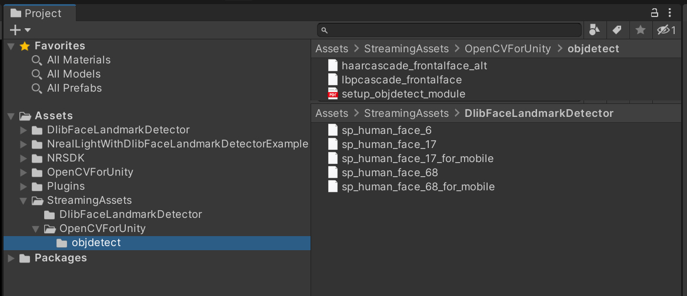
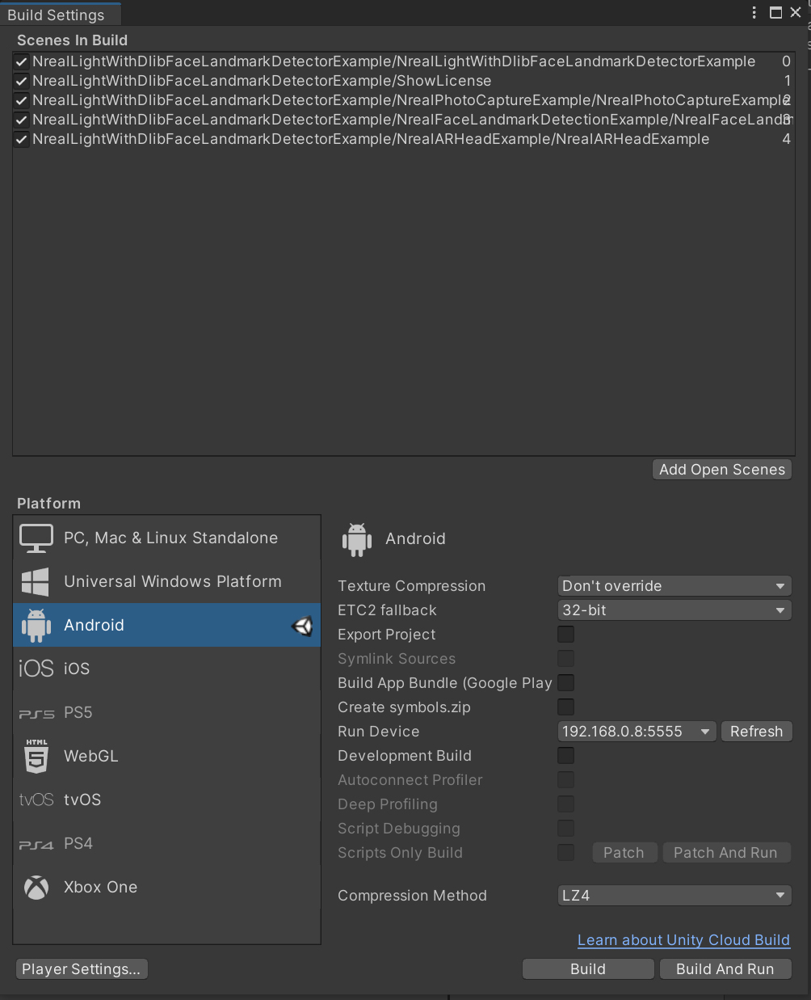
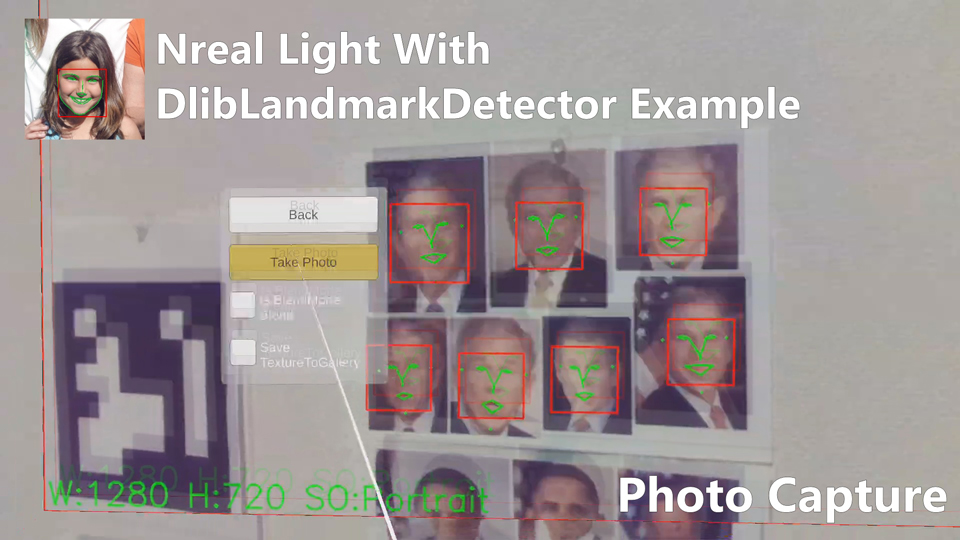
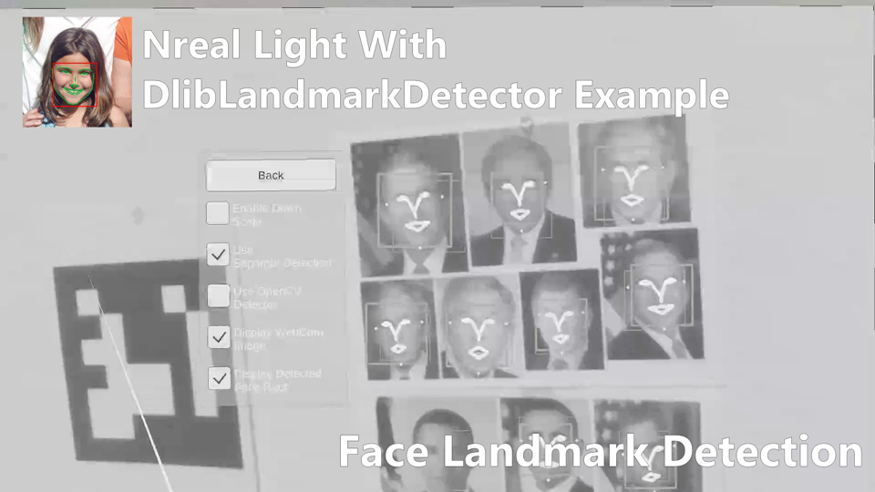

# NrealLight (XREAL Light) With DlibFaceLandmarkDetector Example

## Demo Video

## Demo NrealLight App
* [NrealLightWithDlibFaceLandmarkDetectorExample.apk](https://github.com/EnoxSoftware/NrealLightWithDlibFaceLandmarkDetectorExample/releases)

## Environment
* Android (Galaxy S10+ SC-04L)
* Nebula 3.8.1
* Nreal Light (XREAL Light)
* Unity 2021.3.35f1+ (NRSDK supports the development environment of Unity 2019.4.X and above)
* [NRSDK](https://docs.xreal.com/Release%20Note/NRSDK%202.1.0) NRSDKForUnity 2.1.0 
* [OpenCV for Unity](https://assetstore.unity.com/packages/tools/integration/opencv-for-unity-21088?aid=1011l4ehR) 3.0.0+ 
* [Dlib FaceLandmarkDetector](https://assetstore.unity.com/packages/tools/integration/dlib-facelandmark-detector-64314?aid=1011l4ehR) 2.0.0+ 

## Setup
1. Download the latest release unitypackage. [NrealLightWithDlibFaceLandmarkDetectorExample.unitypackage](https://github.com/EnoxSoftware/NrealLightWithDlibFaceLandmarkDetectorExample/releases)
1. Create a new project. (NrealLightWithDlibFaceLandmarkDetectorExample)
    * Change the platform to Android in the "Build Settings" window.
1. Import the OpenCVForUnity.
    * Select MenuItem[Tools/OpenCV for Unity/Open Setup Tools].
    * Click the [Move StreamingAssets Folder] button.
    * Leave the following files and delete the rest. ("StreamingAssets/OpenCVForUnity/objdetect/haarcascade_frontalface_alt.xml", "lbpcascade_ frontalface.xml")
1. Import the DlibFaceLandmarkDetector.
    * Select MenuItem[Tools/Dlib FaceLandmark Detector/Open Setup Tools].
    * Click the [Move StreamingAssets Folder] button.
    * Leave the following files and delete the rest. ("StreamingAssets/DlibFaceLandmarkDetector/sp_human_face_68.dat", "sp_human_face_68_for_mobile.dat", "sp_human_face_17.dat", "sp_human_face_17_for_mobile.dat" and "sp_human_face_6.dat")
1. Import the NRSDK.
    * Download the latest release NRSDK unitypackage. [NRSDKForUnityAndroid_x.xx.x.unitypackage](https://developer.xreal.com/download)
    * Setup the NRSDK. (See [Getting Started with NRSDK](https://docs.xreal.com/Getting%20Started%20with%20NRSDK))
1. Import the NrealLightWithDlibFaceLandmarkDetectorExample.unitypackage.
1. Add the "Assets/NrealLightWithDlibFaceLandmarkDetectorExample/*.unity" files to the "Scenes In Build" list in the "Build Settings" window.
1. Build and Deploy to Android device. (See [8. Building NRSDK App for Android](https://docs.xreal.com/Getting%20Started%20with%20NRSDK#8-building-nrsdk-app-for-android))

|Project Assets|Build Settings|
|---|---|
|||

## ScreenShot

