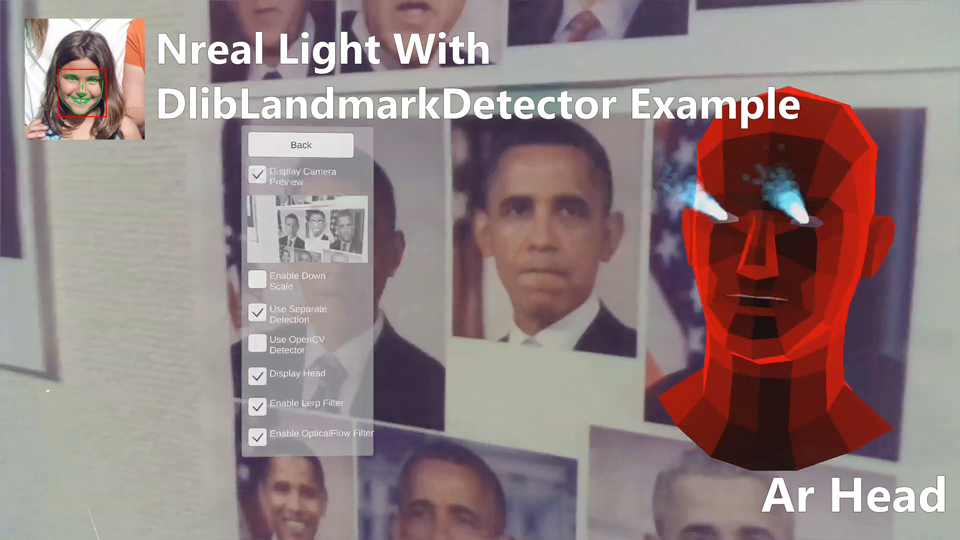

# NrealLight With DlibFaceLandmarkDetector Example

## Demo Video

## Demo Hololens App
* [NrealLightWithDlibFaceLandmarkDetectorExample.zip](https://github.com/EnoxSoftware/NrealLightWithDlibFaceLandmarkDetectorExample/releases)

## Environment
* Android (Galaxy S10+ SC-04L)
* Nreal Light
* Unity 2020.3.38f1+ (NRSDK supports the development environment of Unity 2018.4.X and above.)
* [NRSDK](https://developer.nreal.ai/download)  Unity SDK 1.9.5 
* [OpenCV for Unity](https://assetstore.unity.com/packages/tools/integration/opencv-for-unity-21088?aid=1011l4ehR) 2.4.8+ 
* [Dlib FaceLandmarkDetector](https://assetstore.unity.com/packages/tools/integration/dlib-facelandmark-detector-64314?aid=1011l4ehR) 1.3.3+ 

## Setup
1. Download the latest release unitypackage. [NrealLightWithDlibFaceLandmarkDetectorExample.unitypackage](https://github.com/EnoxSoftware/NrealLightWithDlibFaceLandmarkDetectorExample/releases)
1. Create a new project. (NrealLightWithDlibFaceLandmarkDetectorExample)
    * Change the platform to Android in the "Build Settings" window.
1. Import the OpenCVForUnity.
    * Setup the OpenCVForUnity. (Tools > OpenCV for Unity > Set Plugin Import Settings)
    * Move the "OpenCVForUnity/StreamingAssets/objdetect" folder to the "Assets/StreamingAssets/" folder.
1. Import the DlibFaceLandmarkDetector.
    * Setup the DlibFaceLandmarkDetector. (Tools > Dlib FaceLandmarkDetector > Set Plugin Import Settings)
    * Move the "DlibFaceLandmarkDetector/StreamingAssets/sp_human_face_68.dat", "sp_human_face_68_for_mobile.dat", "sp_human_face_17.dat", "sp_human_face_17_for_mobile.dat" and "sp_human_face_6.dat" files to the "Assets/StreamingAssets/" folder. 
1. Import the NRSDK.
    * Download the latest release NRSDK unitypackage. [NRSDKForUnity_Release_1.9.x.unitypackage](https://developer.nreal.ai/download)
    * Setup the NRSDK. (See [Getting Started with NRSDK](https://nreal.gitbook.io/nrsdk/nrsdk-fundamentals/quickstart-for-android))
1. Import the NrealLightWithDlibFaceLandmarkDetectorExample.unitypackage.
1. Add the "Assets/NrealLightWithDlibFaceLandmarkDetectorExample/*.unity" files to the "Scenes In Build" list in the "Build Settings" window.
1. Build and Deploy to Android device. (See [8. Deploy to Nreal Device](https://nreal.gitbook.io/nrsdk/nrsdk-fundamentals/quickstart-for-android#8.-deploy-to-nreal-device))

|Project Assets|Build Settings|
|---|---|
|||

## ScreenShot

